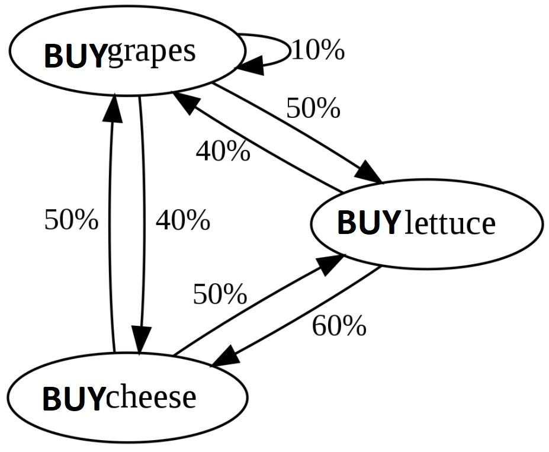

# Customer_Churn_AB_NaiveBayes

## Sales, revenue and CLV analysis with churn prediction by products and markets in funnel

## * Scope and purpose:
This is a 3h+ coding challenge analizing customers that purchase 4 different products in european markets. The ultimate goal is to use Naive Bayes to predict churn. Creating therefore a piece of code that can be tunned with minimal effort to conduct quick experiments before deciding on a production forecasting product. And also evaluating potential business impact in other areas such as marketing and sales thanks to that quick experimentation/prototyping.

Ultimately the exercise is about creating a quick tool/prototype to help in the decision making by using business data.

## * Considerations:
I have included CLV, sales and revenue analysis with cohorts being product and market. Since Churn has to be understood within that context for every company to make use of it as a metric.

## * Notes:
The probability concept used in markov chains can be seen in the graph below.
It shows the buying behaviour of a customer and the probability of buying further items when starting the buying flow with a particular item.

